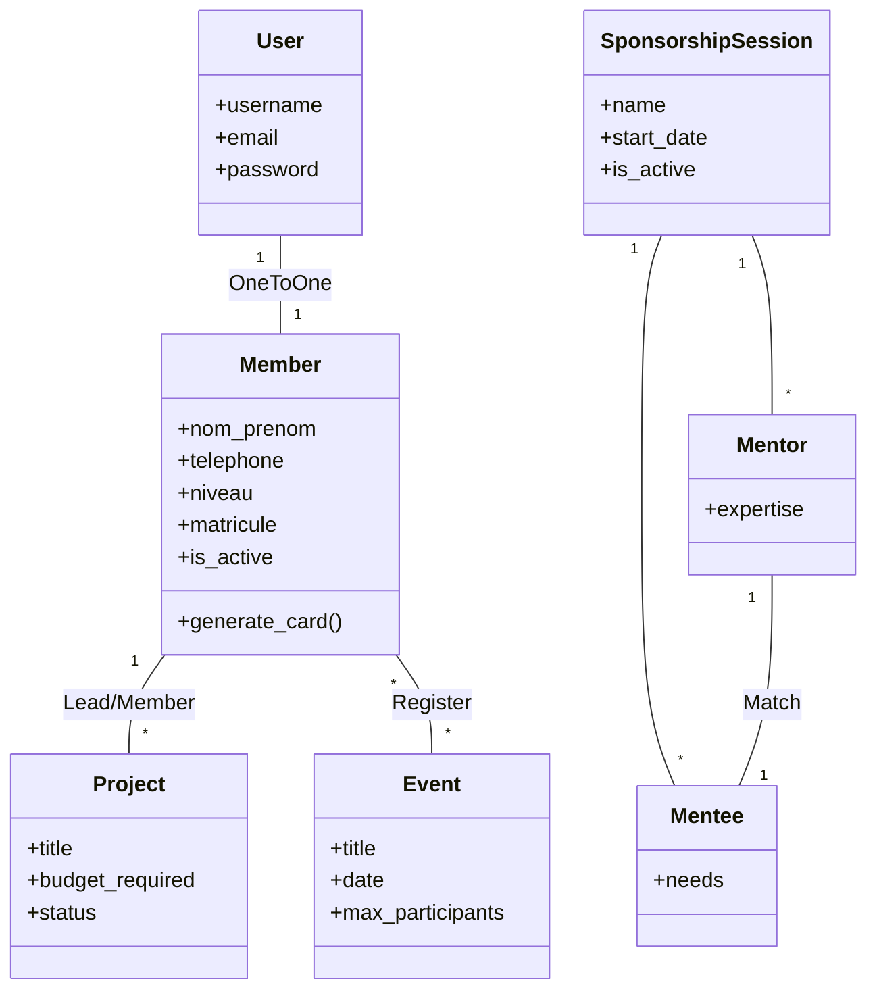
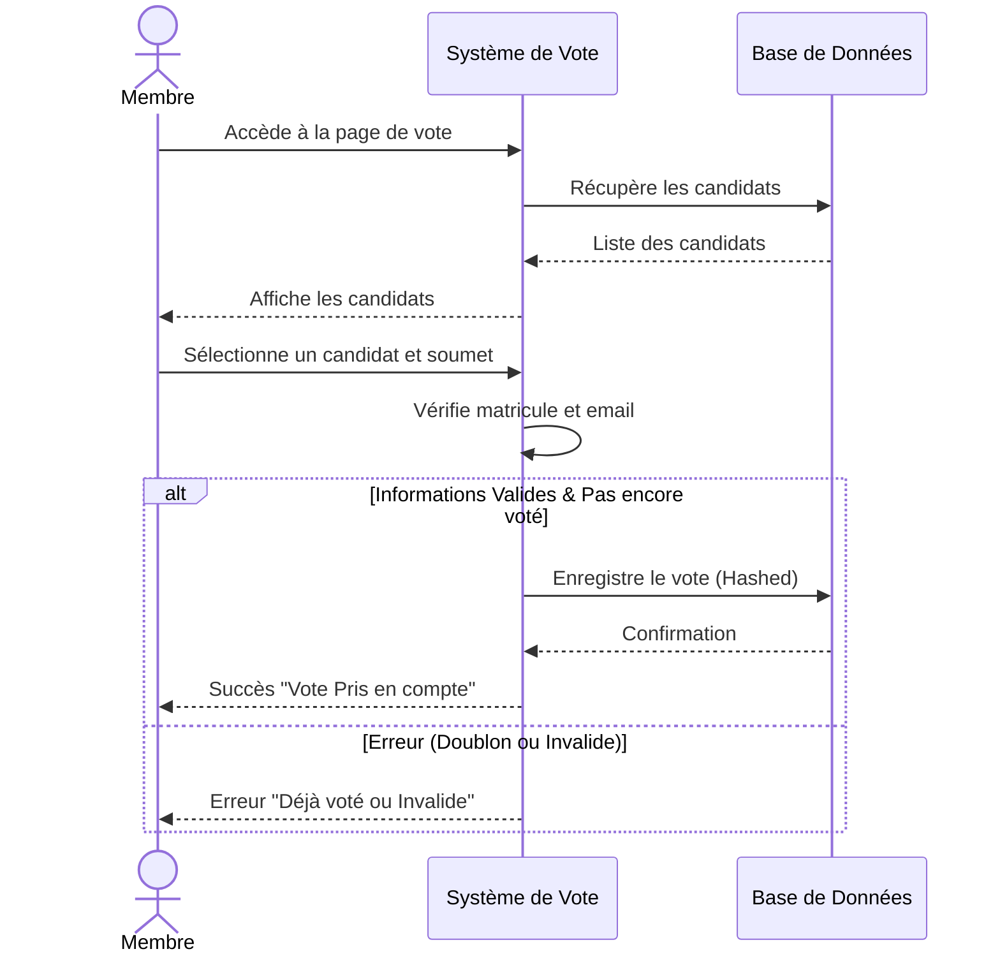
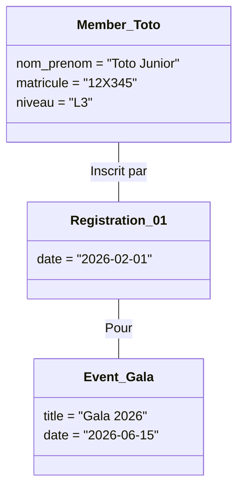

# Document de Conception Technique - COMS.A.S

## 1. Modèle de Données (MCD Simplifié)

Les principaux modèles Django (`models.py`) sont structurés comme suit :

### 1.1. Core / Membres
*   **Member**
    *   `user` (OneToOne -> Auth User)
    *   `nom_prenom`, `email`, `telephone`
    *   `niveau`, `promotion`, `matricule`
    *   `profession`, `bio`, `photo`
    *   `is_active` (Validation)

### 1.2. Activités
*   **Project**
    *   `title`, `description`, `image`
    *   `budget_required`, `budget_collected`
    *   `status` (planning, ongoing, completed)
*   **Event**
    *   `title`, `date`, `location`
    *   `max_participants`
*   **EventRegistration**
    *   Lien `Member` <-> `Event`

### 1.3. Parrainage
*   **SponsorshipSession** : Période de parrainage (ex: "Session 2025").
*   **Mentor** : Inscrit pour une session, liste de compétences.
*   **Mentee** : Inscrit pour une session, besoins spécifiques.
*   **Match** : Binôme `Mentor` <-> `Mentee` validé.

### 1.4. Votes
*   **Contest** : Élection ou Concours.
*   **Candidate** : Candidat lié à un `Contest`.
*   **Vote** : Enregistrement d'un vote (`Contest`, `Candidate`, `voter_email` hashé).

## 2. Diagramme de Classes (UML)

## 3. Diagramme de Séquence (Processus de Vote)

## 4. Diagramme d'Objets (Exemple d'Instance)

## 5. Sécurité et Permissions

*   **Rôles** :
    *   `Staff/Superuser` : Accès complet au `admin_dashboard`.
    *   `Member` (Authentifié) : Accès aux votes, inscriptions événements.
    *   `Public` : Lecture seule sur le site vitrine.

*   **Middleware** :
    *   `AdminAuthMiddleware` : Force la connexion staff pour accéder à `/dashboard/`.

## 3. Flux de Données (Exemple : Génération Carte)

1.  Admin clique "Valider et Envoyer Carte" sur un membre.
2.  **View** : `validate_and_send_card` (admin action).
3.  **Logic** :
    *   Mise à jour `member.is_active = True`.
    *   Appel `generate_member_card(member)`.
    *   Génération PDF via `reportlab` (canvas drawing).
    *   Génération QR via `qrcode` (URL profile).
4.  **Email** : Envoi asynchrone (ou synchrone simple) avec PDF en pièce jointe.

## 4. Internationalisation
*   Le site est prêt pour le multilingue (champs `_fr`, `_en` présents dans les modèles) mais configuré principalement en Français par défaut.

## 5. Déploiement
*   **Production** :
    *   `DEBUG = False`
    *   Serveur statique (WhiteNoise ou Nginx alias).
    *   HTTPS forcé.
